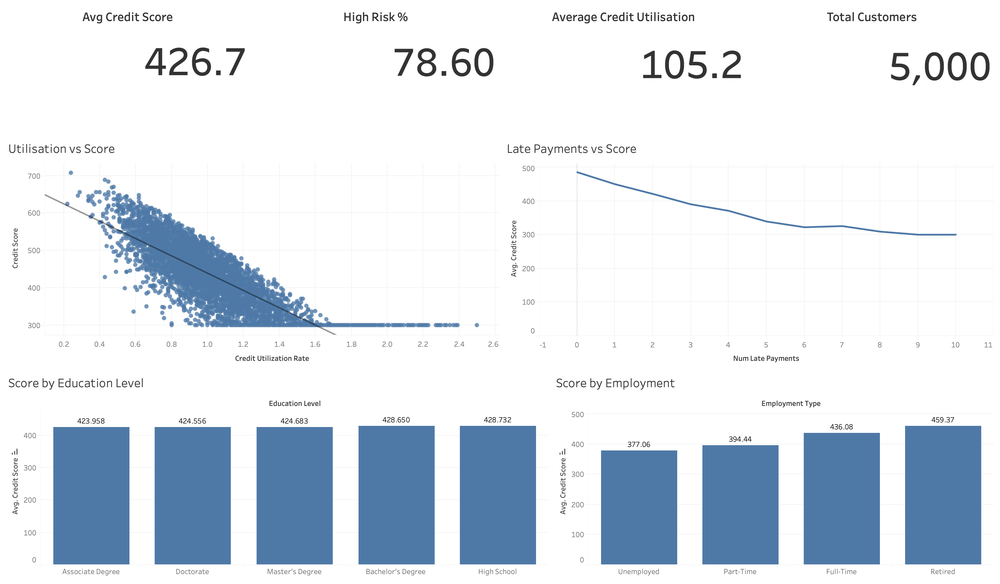

# 🏦 US Credit Score Analysis

This project explores the factors affecting credit scores across the United States using Python, Machine Learning, and Tableau. It involves deep data analysis, predictive modeling, and dashboard storytelling to assess credit risk and score behavior among 5,000+ customers.

---

## 📊 Project Overview

**Goal:**  
To understand and visualize the impact of various factors (like credit utilization, late payments, education, employment) on customer credit scores and identify high-risk segments.

**Tools Used:**
- 🐍 Python (Pandas, Matplotlib, Seaborn, Scikit-learn)
- 🤖 Machine Learning (Feature importance, Classification models)
- 📈 Tableau (for interactive dashboards and KPI summaries)

---

## 📁 Project Structure
```
📁 US_Credit_Analysis/
  ├── US_Credit_analysis_Snapshots   # Screenshot for Tableau dashboard 
  ├── US_Credit_analysis.twb         #Tableau file
  ├── US_credit_data_analysis.ipynb  # Python/ML code with data cleaning, EDA, modeling 
  ├── us_credit_dataset.csv          # dataset
  └── README.md                      # This file
``` 

---

## 🔧 Methods & Techniques

### 📌 Data Analysis (Python)
- Handled missing values, outliers, and normalization
- Visualized key trends (e.g., utilization vs. score, late payments)
- Analyzed distributions by demographic and employment factors

### 🤖 Machine Learning
- Feature selection and importance analysis
- Built classification models to predict high-risk individuals
- Evaluated model performance with accuracy and confusion matrix

### 📊 Tableau Dashboard
- Created KPIs for:
  - Average Credit Score
  - High-Risk %
  - Average Credit Utilization
  - Total Customers
- Visual breakdowns:
  - Score vs Utilization Rate
  - Late Payments vs Score
  - Score by Education Level
  - Score by Employment

---

## 💡 Key Insights

- **High Credit Utilization** is strongly linked with lower credit scores.
- More **late payments** steadily reduce credit scores.
- **Unemployed** individuals show the lowest average scores.
- **Education level** has a relatively small impact on scores.
- Around **78.6%** of customers are in the **high-risk** category.

---

## 📎 Conclusion

This project demonstrates how:
- **Python & ML** enable deep, automated data understanding and predictive modeling.
- **Tableau** provides accessible visual storytelling for decision-makers.

Together, these tools offer a powerful end-to-end solution for credit risk analysis.

---

### 📊 Tableau Dashboard




🔗 [Click here to view the full interactive dashboard](https://public.tableau.com/app/profile/rohit.rajgoli5713/viz/US_Credit_Analysis/Dashboard1#1)


---

## ✅ Future Improvements
- Deploy the model as an API for real-time risk scoring
- Use more granular credit history data (e.g., payment dates)
- Add geographic segmentation (e.g., by state or zip)

---

## 📬 Contact

Created by Rohiy Rajgoli 
Feel free to connect or reach out on

- 🔗 [LinkedIn](https://www.linkedin.com/in/rohit-rajgoli/)
- 💻 [GitHub Portfolio](https://github.com/RohitRajgoli/RohitRajgoli.github.io)
- 📧 rajgolirohit@gmail.com
